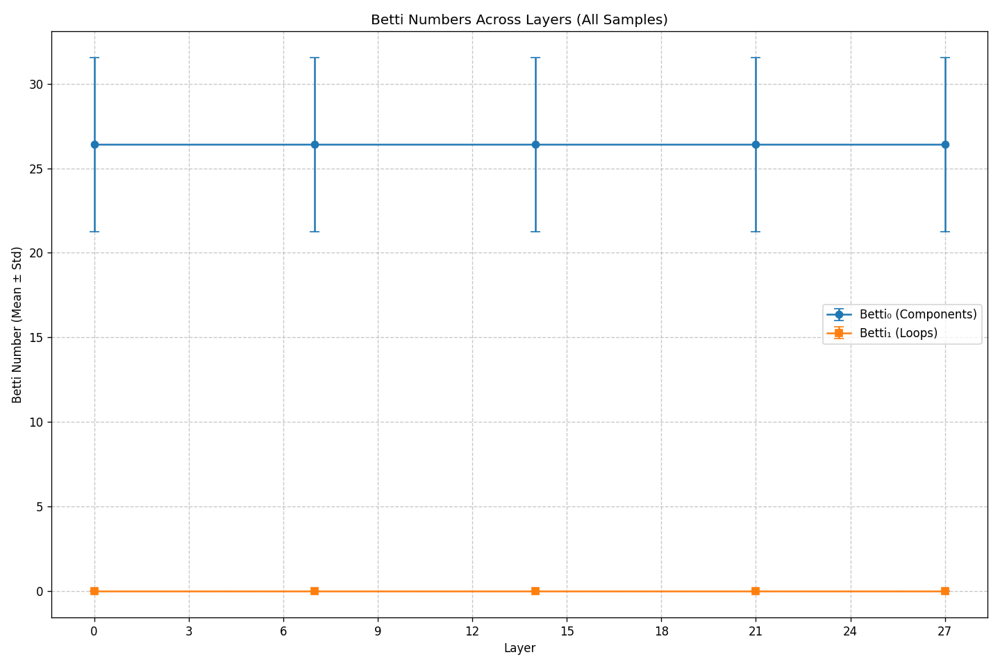
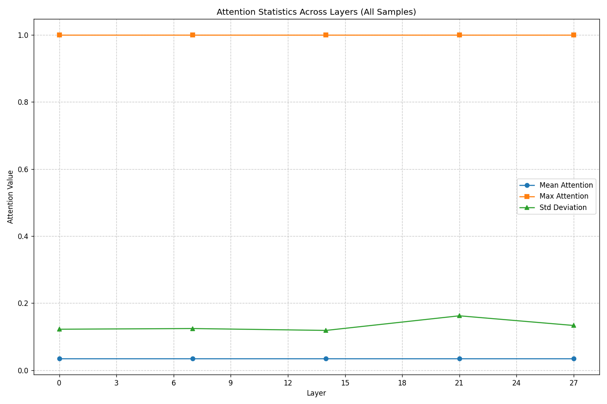
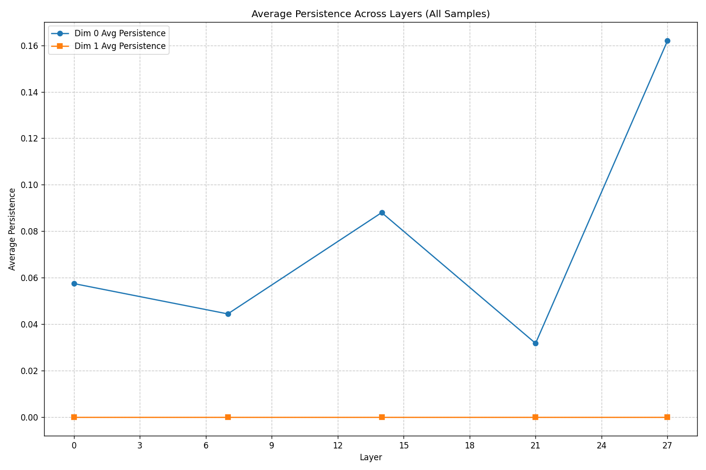

# Transformer Attention Topology Analysis

## Analysis Overview

- **Model**: meta-llama/llama-3.2-3B
- **Samples Analyzed**: 500
- **Max Tokens Per Sample**: 48
- **Layers Analyzed**: [0, 7, 14, 21, 27]
- **Analysis Date**: 2025-05-08 15:30:15

## Summary of Findings

### Key Findings

1. **Head specialization**: Found 120 heads with consistent token focus. The most specialized is layer 0, head 0 focusing on token '<|begin_of_text|>' with 100.0% consistency.
2. **Layer specialization**: Layer 0 has the most specialized attention heads (24), suggesting specialized processing at this depth.
3. **Topological significance**: Dimension 0 persistence increases from 0.0574 in layer 0 to 0.1620 in layer 27, suggesting more stable connected components in deeper layers.

## Topological Features (Betti Numbers)

Betti numbers measure topological features: Betti₀ counts connected components, while Betti₁ counts loops/cycles in the attention structure.

| Layer | Betti₀ (Mean ± Std) | Betti₁ (Mean ± Std) | Sample Count |
|-------|-------------------|-------------------|-------------|
| 0 | 26.41 ± 5.14 | 0.00 ± 0.00 | 500 |
| 7 | 26.41 ± 5.14 | 0.00 ± 0.00 | 500 |
| 14 | 26.41 ± 5.14 | 0.00 ± 0.00 | 500 |
| 21 | 26.41 ± 5.14 | 0.00 ± 0.00 | 500 |
| 27 | 26.41 ± 5.14 | 0.00 ± 0.00 | 500 |

## Attention Distribution Analysis

This section examines how attention is distributed across tokens in different layers.

| Layer | Mean Attention (± Std) | Max Attention (± Std) | Attention StdDev (± Std) |
|-------|----------------------|---------------------|------------------------|
| 0 | 0.0351 ± 0.0146 | 1.0000 ± 0.0000 | 0.1222 ± 0.0289 |
| 7 | 0.0351 ± 0.0146 | 1.0000 ± 0.0000 | 0.1242 ± 0.0308 |
| 14 | 0.0351 ± 0.0146 | 1.0000 ± 0.0000 | 0.1186 ± 0.0286 |
| 21 | 0.0351 ± 0.0146 | 1.0000 ± 0.0000 | 0.1622 ± 0.0325 |
| 27 | 0.0351 ± 0.0146 | 1.0000 ± 0.0000 | 0.1333 ± 0.0281 |

## Topological Persistence Analysis

Persistence measures the 'significance' of topological features. Higher persistence values indicate more prominent features.

| Layer | Dim0 Avg Persistence | Dim1 Avg Persistence |
|-------|---------------------|---------------------|
| 0 | 0.0574 | N/A |
| 7 | 0.0444 | N/A |
| 14 | 0.0880 | N/A |
| 21 | 0.0317 | N/A |
| 27 | 0.1620 | N/A |

## Statistical Significance

A detailed analysis of statistical significance tests is available in the [Statistical Significance Report](statistical_significance.md).

This report shows which differences between layers are statistically significant (p < 0.05) and which might be due to random variation.
