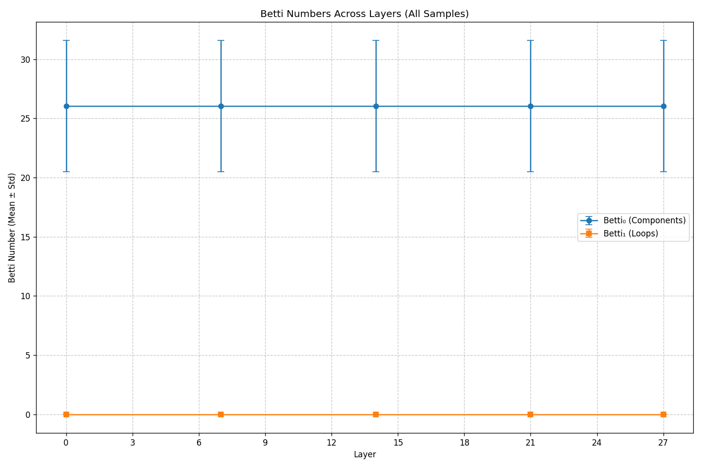
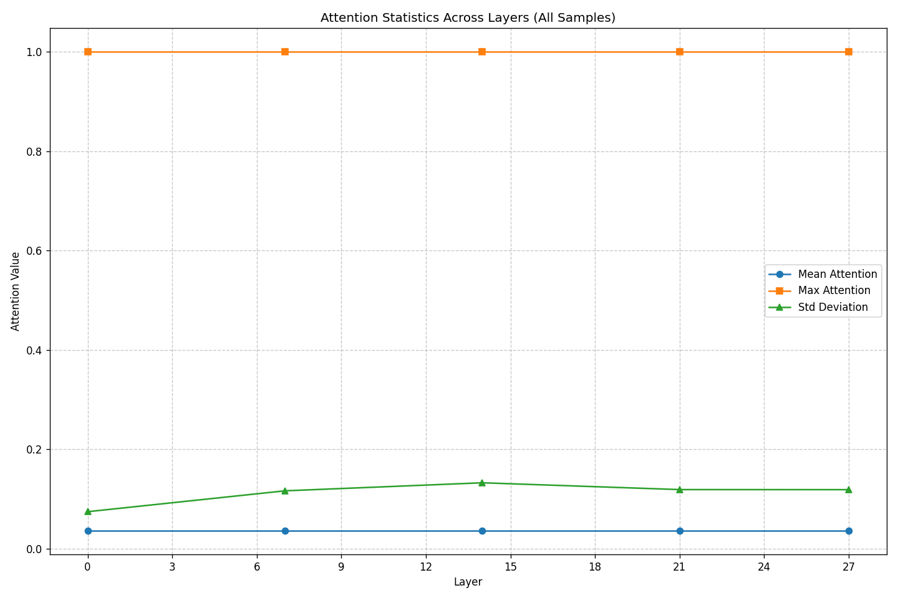
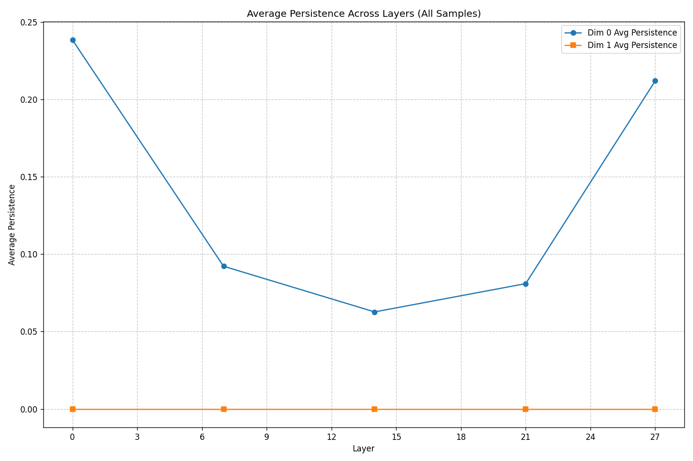

# Transformer Attention Topology Analysis

## Analysis Overview

- **Model**: Qwen/Qwen2.5-7B
- **Samples Analyzed**: 500
- **Max Tokens Per Sample**: 48
- **Layers Analyzed**: [0, 7, 14, 21, 27]
- **Analysis Date**: 2025-05-08 16:00:19

## Summary of Findings

### Key Findings

1. **Head specialization**: Found 7 heads with consistent token focus. The most specialized is layer 0, head 3 focusing on token ',' with 64.2% consistency.
2. **Layer progression**: Attention topology changes significantly between early and late layers, reflecting the model's hierarchical processing.
3. **Structural consistency**: Despite variations between samples, consistent topological patterns emerge across the dataset.

## Topological Features (Betti Numbers)

Betti numbers measure topological features: Betti₀ counts connected components, while Betti₁ counts loops/cycles in the attention structure.

| Layer | Betti₀ (Mean ± Std) | Betti₁ (Mean ± Std) | Sample Count |
|-------|-------------------|-------------------|-------------|
| 0 | 26.03 ± 5.55 | 0.00 ± 0.00 | 500 |
| 7 | 26.03 ± 5.55 | 0.00 ± 0.00 | 500 |
| 14 | 26.03 ± 5.55 | 0.00 ± 0.00 | 500 |
| 21 | 26.03 ± 5.55 | 0.00 ± 0.00 | 500 |
| 27 | 26.03 ± 5.55 | 0.00 ± 0.00 | 500 |

## Attention Distribution Analysis

This section examines how attention is distributed across tokens in different layers.

| Layer | Mean Attention (± Std) | Max Attention (± Std) | Attention StdDev (± Std) |
|-------|----------------------|---------------------|------------------------|
| 0 | 0.0362 ± 0.0162 | 1.0000 ± 0.0000 | 0.0741 ± 0.0225 |
| 7 | 0.0362 ± 0.0162 | 1.0000 ± 0.0000 | 0.1161 ± 0.0301 |
| 14 | 0.0362 ± 0.0162 | 1.0000 ± 0.0000 | 0.1323 ± 0.0348 |
| 21 | 0.0362 ± 0.0162 | 1.0000 ± 0.0000 | 0.1186 ± 0.0312 |
| 27 | 0.0362 ± 0.0162 | 1.0000 ± 0.0000 | 0.1185 ± 0.0310 |

## Topological Persistence Analysis

Persistence measures the 'significance' of topological features. Higher persistence values indicate more prominent features.

| Layer | Dim0 Avg Persistence | Dim1 Avg Persistence |
|-------|---------------------|---------------------|
| 0 | 0.2384 | N/A |
| 7 | 0.0922 | N/A |
| 14 | 0.0627 | N/A |
| 21 | 0.0810 | N/A |
| 27 | 0.2120 | N/A |

## Statistical Significance

A detailed analysis of statistical significance tests is available in the [Statistical Significance Report](statistical_significance.md).

This report shows which differences between layers are statistically significant (p < 0.05) and which might be due to random variation.
