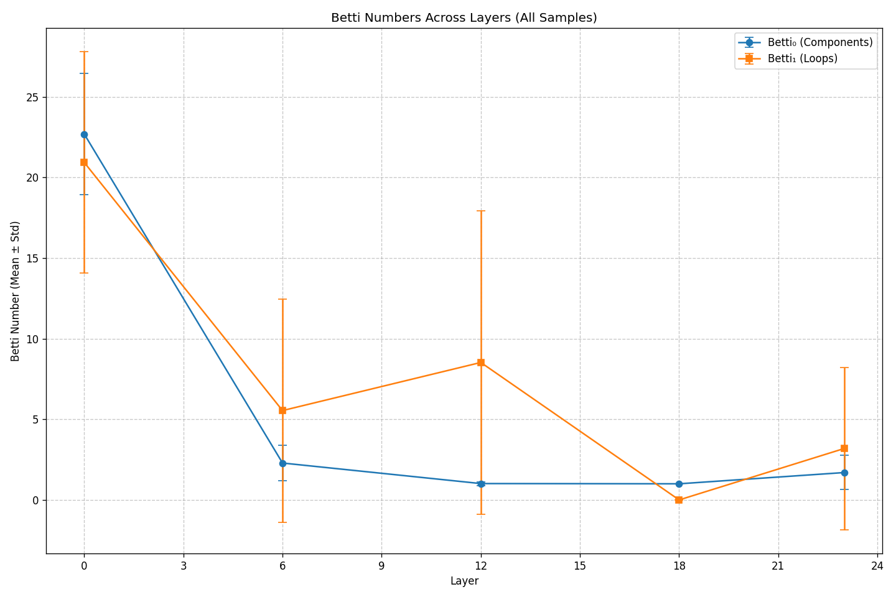
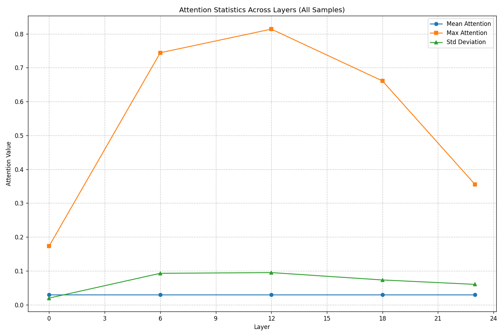
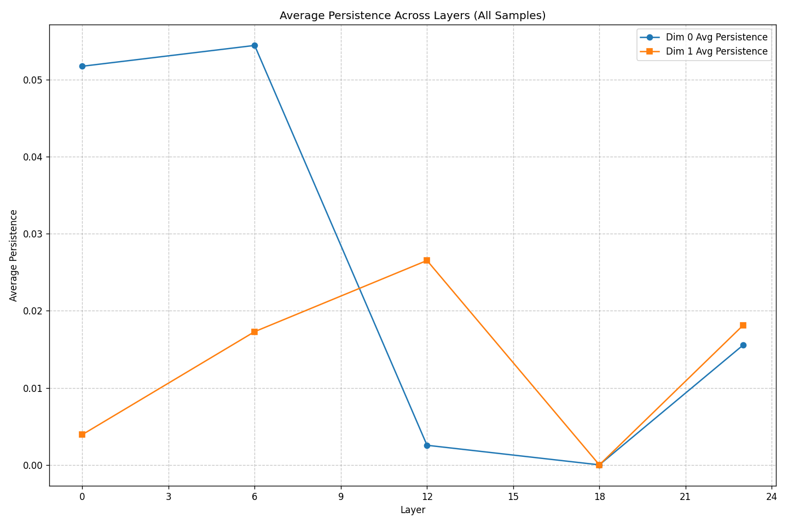

# Transformer Attention Topology Analysis

## Analysis Overview

- **Model**: FacebookAI/xlm-roberta-large
- **Samples Analyzed**: 500
- **Max Tokens Per Sample**: 48
- **Layers Analyzed**: [0, 6, 12, 18, 23]
- **Analysis Date**: 2025-05-08 17:07:36

## Summary of Findings

### Key Findings

1. **Component integration**: Connected components decrease from 22.7 in layer 0 to 1.7 in layer 23, suggesting attention becomes more integrated in deeper layers. This difference is statistically significant (p=0.0000).
2. **Cyclic simplification**: Loops decrease from 20.9 in layer 0 to 3.2 in layer 23, suggesting attention forms simpler patterns in deeper layers. This difference is statistically significant (p=0.0000).
3. **Head specialization**: Found 77 heads with consistent token focus. The most specialized is layer 0, head 1 focusing on token '<s>' with 100.0% consistency.
4. **Layer specialization**: Layer 18 has the most specialized attention heads (16), suggesting specialized processing at this depth.

## Topological Features (Betti Numbers)

Betti numbers measure topological features: Betti₀ counts connected components, while Betti₁ counts loops/cycles in the attention structure.

| Layer | Betti₀ (Mean ± Std) | Betti₁ (Mean ± Std) | Sample Count |
|-------|-------------------|-------------------|-------------|
| 0 | 22.69 ± 3.75 | 20.93 ± 6.86 | 500 |
| 6 | 2.29 ± 1.09 | 5.54 ± 6.93 | 500 |
| 12 | 1.01 ± 0.12 | 8.52 ± 9.42 | 500 |
| 18 | 1.00 ± 0.00 | 0.00 ± 0.00 | 500 |
| 23 | 1.70 ± 1.06 | 3.19 ± 5.03 | 500 |

## Attention Distribution Analysis

This section examines how attention is distributed across tokens in different layers.

| Layer | Mean Attention (± Std) | Max Attention (± Std) | Attention StdDev (± Std) |
|-------|----------------------|---------------------|------------------------|
| 0 | 0.0299 ± 0.0110 | 0.1732 ± 0.0249 | 0.0196 ± 0.0068 |
| 6 | 0.0299 ± 0.0110 | 0.7441 ± 0.0990 | 0.0927 ± 0.0196 |
| 12 | 0.0299 ± 0.0110 | 0.8139 ± 0.1368 | 0.0948 ± 0.0250 |
| 18 | 0.0299 ± 0.0110 | 0.6609 ± 0.0319 | 0.0731 ± 0.0169 |
| 23 | 0.0299 ± 0.0110 | 0.3552 ± 0.0456 | 0.0600 ± 0.0107 |

## Topological Persistence Analysis

Persistence measures the 'significance' of topological features. Higher persistence values indicate more prominent features.

| Layer | Dim0 Avg Persistence | Dim1 Avg Persistence |
|-------|---------------------|---------------------|
| 0 | 0.0518 | 0.0039 |
| 6 | 0.0545 | 0.0173 |
| 12 | 0.0025 | 0.0265 |
| 18 | N/A | N/A |
| 23 | 0.0155 | 0.0181 |

## Statistical Significance

A detailed analysis of statistical significance tests is available in the [Statistical Significance Report](statistical_significance.md).

This report shows which differences between layers are statistically significant (p < 0.05) and which might be due to random variation.
